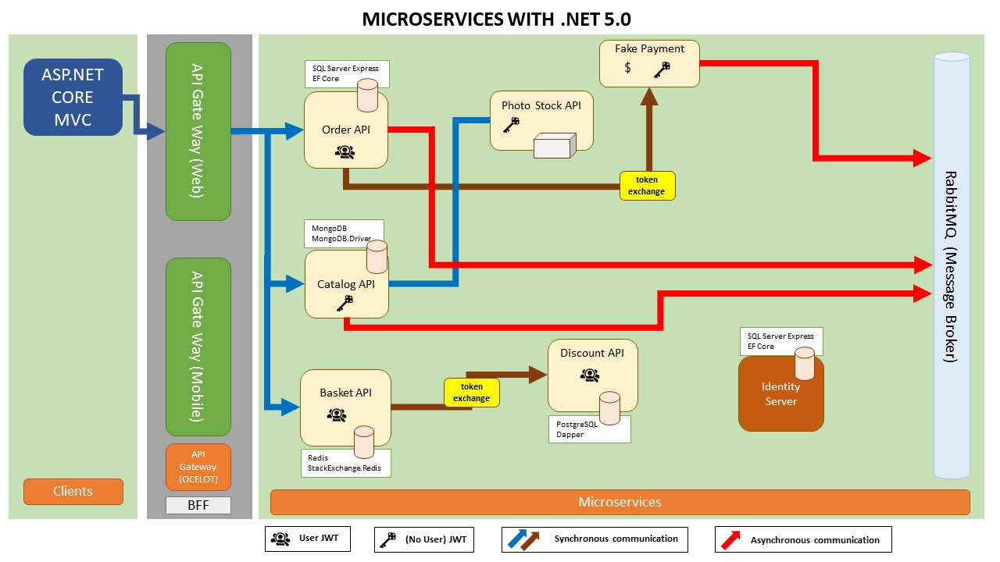

# NET5 Academy
It is a course system created to apply current technologies. Instructors and trainees will be able to participate and use the system.

    

## Used Techs and Methods
- ASP.NET 5.0
- ASP.NET Core MVC
- Identity Server
- Microservices
- API Gateway (Ocelot)
- Entity Framework Core
- SQL Server Express
- PostgreSQL
- MongoDB
- Dapper
- Redis
- RabbitMQ
- AutoMapper
- SOLID principle
- Domain Driven Design
- CQRS
- Portainer

     

## Diagram

## Features
- Shared / Library 
- IdentityServer (MSSQL, EF Core) 
- Catalog microservice (MongoDB) 
- PhotoStock microservice 
- Basket microservice (Redis)  
- Discount microservice (PostgreSQL, Dapper) 
- Order microservice (MSSQL, EF Core, Domain Driven Design, CQRS) 
- Payment microservice 
- API Gateway (Ocelot)
- ASP.NET Core MVC Web Application
- MassTransit RabbitMQ (Message Broker)
- Eventual Consistency
- Token Exchange
- Docker Containers
