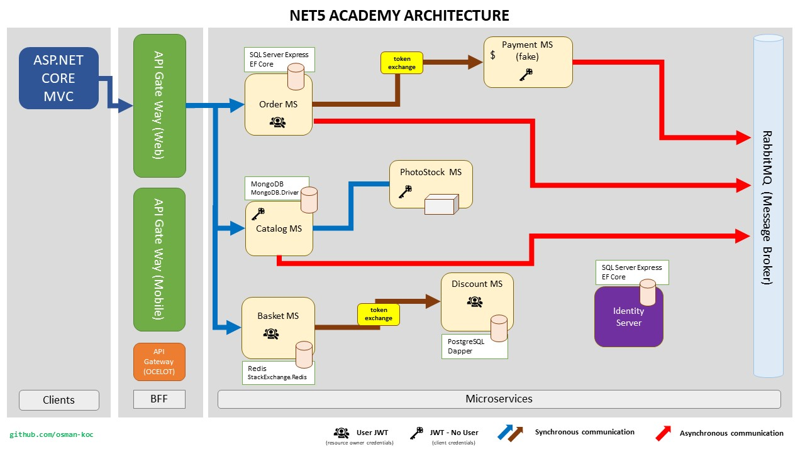

# NET5 Academy
It is a course system created to apply current technologies. Instructors and trainees will be able to participate and use the system.

## Used Techs
- ASP.NET 5.0
- ASP.NET Core MVC
- Identity Server
- Microservices
- API Gateway (Web, Mobile, Ocelot)
- Entity Framework Core
- SQL Server Express
- PostgreSQL
- MongoDB
- Dapper
- Redis
- RabbitMQ
- AutoMapper

## Diagram

## Features
- Shared / Library 
- IdentityServer 
- Catalog microservice 
- PhotoStock microservice 
- Basket microservice  
- Discount microservice
- Payment microservice
- Order microservice
- API Gateway
- MVC Web Application
